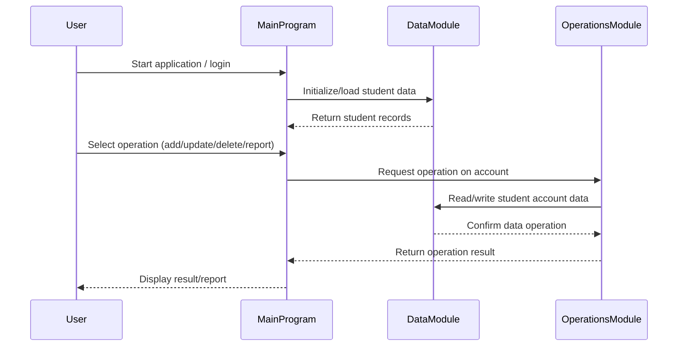

# COBOL Source Documentation

This project contains legacy COBOL code for managing student accounts. Below is an overview of each COBOL file, their key functions, and business rules implemented.

## File Overview

### `main.cob`
**Purpose:**
- Entry point for the COBOL application.
- Handles initialization, program flow, and user interaction.

**Key Functions:**
- Program startup and shutdown routines.
- Calls to other modules for data operations and business logic.

**Business Rules:**
- Ensures proper initialization of student account data.
- Manages main menu and user navigation.

---

### `data.cob`
**Purpose:**
- Manages data storage and retrieval for student accounts.
- Defines data structures and file I/O operations.

**Key Functions:**
- Reading and writing student account records.
- Data validation and error handling.

**Business Rules:**
- Validates student account fields (e.g., ID, name, balance).
- Ensures data integrity during updates and queries.

---

### `operations.cob`
**Purpose:**
- Implements business logic and operations on student accounts.

**Key Functions:**
- Adding, updating, and deleting student accounts.
- Processing transactions (e.g., payments, charges).
- Generating reports and summaries.

**Business Rules:**
- Enforces rules for account creation and modification.
- Handles transaction limits and validation.
- Generates account summaries for reporting.

---

## Business Rules Summary
- Student accounts must have unique IDs.
- Transactions are validated for sufficient balance and correct account status.
- Data integrity is maintained across all operations.

For further details, refer to the source code in `/src/cobol/`.

---

## Sequence Diagram: Student Account Data Flow

